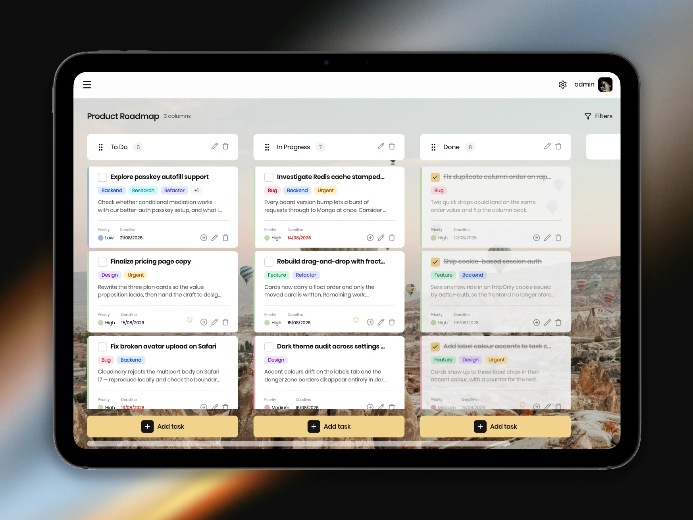

# Task Pro

The Kanban task manager for organizing work into boards, columns and cards —
with drag-and-drop, fuzzy search, passkey sign-in and a deeply customizable
interface.

[Live App](https://www.taskpro.qzz.io) · [Backend Repo](https://github.com/chertik77/TaskPro-backend)

## Features

- **Authentication:**
  Sign up or log in with email and password, Google or Microsoft, or skip the
  password entirely with WebAuthn passkeys. Active sessions are listed per device
  and can be revoked individually.

- **Custom Boards:**
  Create and personalize boards with unique icons and background images,
  organizing separate workspaces however suits the work.

- **Drag and Drop:**
  Tasks and columns move with dnd-kit, including cross-column drags, a live drag
  overlay and optimistic reordering that updates instantly instead of waiting on
  the server.

- **Task Management:**
  Add, edit, prioritize and complete tasks with labels, priorities and deadlines.
  Reusable labels are shared across boards, and deadlines can be entered in plain
  language through natural-language date parsing.

- **Fuzzy Search and Filtering:**
  Weighted fuzzy search across task titles, descriptions and label names finds
  cards even when the query is not an exact match, and it composes with priority,
  deadline and label filters.

- **Appearance Customization:**
  Light, dark and system themes, accent colors, font size, card density,
  board background blur and animation preferences — all synced to the account.
  Appearance is applied by an inline bootstrap script before first paint, so
  there is no flash of the wrong theme on load.

- **Motion:**
  Animated dialogs, board transitions and micro-interactions built with Motion,
  respecting the user's reduced-motion preference.

- **Profile Management:**
  Update profile details and crop a new avatar in place before uploading.

- **Keyboard Shortcuts:**
  Toggle the sidebar with <kbd>⌘</kbd> + <kbd>B</kbd> on macOS or <kbd>Ctrl</kbd> + <kbd>B</kbd> on Windows and Linux.

- **Accessibility:**
  Full keyboard navigation, roving focus in menus and lists, and live screen
  reader announcements during drag-and-drop that read out what was picked up,
  where it moved and where it landed.

- **Get Help Fast:**
  Send a support request straight from the app without leaving the board.

- **Type-Safe API Layer:**
  The entire API client — types, TanStack Query hooks and Valibot validators — is
  generated from the backend's OpenAPI schema, so a contract change surfaces as a
  compile error rather than a runtime surprise.

- **Architecture:**
  Organized with Feature-Sliced Design, enforced
  in CI by Steiger so layer boundaries and import rules cannot silently rot.

## Project Contributors

- [Denys Babych](https://github.com/chertik77) - Team Leader
- [Sergii Drozdiuk](https://github.com/Sergii-Drozdiuk) - Scrum Master
- [Andrii Malysh](https://github.com/Agmund2002) - Fullstack developer
- [Valeriia Trytiak](https://github.com/Valeriia-Trytiak) - Fullstack developer
- [Anton Rybalko](https://github.com/AntonRybalko777) - Fullstack developer
- [Vitalii Somov](https://github.com/MorskoySom) - Fullstack developer
- [Andrii Zirchenko](https://github.com/Andrey9019) - Fullstack developer
- [Valentin Moroz](https://github.com/Valentun2) - Fullstack developer
- [Kateryna Khamko](https://github.com/Katya982) - Fullstack developer
- [Anastasiia Martorella](https://github.com/Cajamarquina) - Fullstack developer

## Languages and Tools

## License

Released under the [MIT License](./LICENSE) — © 2024-2026 Denys Babych.
